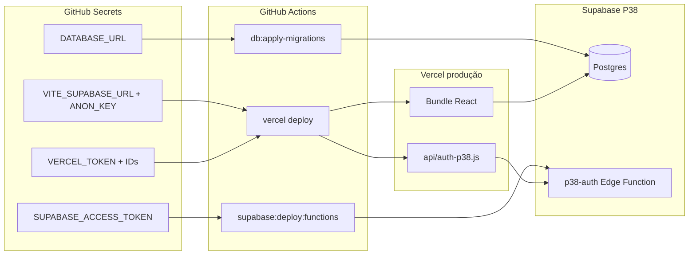

# P38 — Secrets canónicos (checklist pré-decolagem)

João, este documento é o **mapa único** das chaves de ligação. Depois de configurado, o sistema deve funcionar como **avião comercial**: decola uma vez, só pousa — sem “pane” por secret errado ou projecto Supabase diferente.

## Regra de ouro

| Onde | O quê |
|------|--------|
| **GitHub Actions** (Settings → Secrets → Actions) | Fonte de verdade para deploy automático |
| **Vercel** (env de produção) | Só o que o browser e o proxy serverless precisam |
| **Cursor Cloud Agent** | Mesmos nomes que GitHub — **nunca** o secret ambíguo `supabase` |
| **`.env.local`** (só na tua máquina) | Desenvolvimento local — **não commitar** |

Antes de qualquer deploy: `npm run secrets:check`

---

## Tabela canónica

| Nome canónico | Para quê | Onde colocar | Pode ir no frontend? |
|---------------|----------|--------------|----------------------|
| `VITE_SUPABASE_URL` | URL do projecto Supabase | GitHub, Vercel, `.env.local` | Sim (público) |
| `VITE_SUPABASE_ANON_KEY` | Chave anon (leitura com RLS) | GitHub, Vercel, `.env.local` | Sim (pública por desenho) |
| `VITE_P38_PROVIDER` | `supabase` em produção | Vercel | Sim |
| `VITE_P38_BYPASS_BASE44` | `true` em produção | Vercel | Sim |
| `VITE_P38_USE_SUPABASE_AUTH` | `true` — login interno P38 | Vercel | Sim |
| `DATABASE_URL` | Migrações SQL (`npm run db:apply-migrations`) | GitHub Actions, Cloud Agent | **Nunca** |
| `SUPABASE_ACCESS_TOKEN` | PAT — deploy Edge Functions | GitHub Actions, Cloud Agent | **Nunca** |
| `SUPABASE_SERVICE_ROLE_KEY` | Scripts admin / futuro proxy estável | GitHub (opcional), Vercel serverless | **Nunca** |
| `P38_AUTH_URL` | URL da função `p38-auth` (proxy Vercel) | Vercel (opcional — deriva da URL) | **Nunca** |
| `VERCEL_TOKEN` | Deploy Vercel | GitHub Actions | **Nunca** |
| `VERCEL_ORG_ID` | ID da conta Vercel | GitHub Actions | **Nunca** |
| `VERCEL_PROJECT_ID` | ID do projecto `p-38erp` | GitHub Actions | **Nunca** |

**Project ref P38 actual:** `zhonvxkkqabfdyehyxpu`  
(URL: `https://zhonvxkkqabfdyehyxpu.supabase.co`)

---

## Onde obter cada valor (Supabase Dashboard)

1. **Project URL + anon key**  
   Supabase → Project Settings → **API**  
   - Project URL → `VITE_SUPABASE_URL`  
   - `anon` `public` → `VITE_SUPABASE_ANON_KEY`

2. **Connection string (Postgres)**  
   Supabase → Project Settings → **Database** → Connection string → **URI** (pooler recomendado)  
   → `DATABASE_URL`

3. **Personal Access Token (deploy functions)**  
   https://supabase.com/dashboard/account/tokens  
   → `SUPABASE_ACCESS_TOKEN` (começa por `sbp_`)

4. **Service role** (só scripts / serverless — não no bundle React)  
   Supabase → API → `service_role` → `SUPABASE_SERVICE_ROLE_KEY`

---

## Aliases legados (evitar)

O script `npm run secrets:check` aceita estes nomes antigos mas **avisa**:

| Alias (não usar) | Use em vez disso |
|------------------|------------------|
| `SUPABASE_TOKEN` | `SUPABASE_ACCESS_TOKEN` |
| `SUPABASE_ANON_KEY` | `VITE_SUPABASE_ANON_KEY` |
| `SUPABASE_URL` | `VITE_SUPABASE_URL` |
| `supabase` (minúsculas, Cloud) | `SUPABASE_ACCESS_TOKEN` **ou** `DATABASE_URL` — **nunca os dois no mesmo secret** |

---

## Checklist por cenário

### Deploy produção (GitHub → Vercel + Supabase)

```bash
npm run secrets:check -- --context=github
```

Precisa de: `VERCEL_*`, `VITE_SUPABASE_*`, `DATABASE_URL`, `SUPABASE_ACCESS_TOKEN`.

### Só frontend local

```bash
npm run secrets:check -- --context=local
```

Precisa de: `VITE_SUPABASE_URL`, `VITE_SUPABASE_ANON_KEY`.

### Cursor Cloud Agent (auditoria, migrações, flares)

Mesmos nomes que GitHub Actions. Ver também `AGENTS.md` → secção Base44/Supabase.

---

## Fluxo visual



---

## Comandos úteis

| Comando | Função |
|---------|--------|
| `npm run secrets:check` | Validação completa |
| `npm run supabase:align:check` | Confirma DATABASE_URL = mesmo projecto que VITE_SUPABASE_URL |
| `npm run supabase:deploy:check` | Diagnóstico deploy Supabase |
| `npm run build` | Bundle OK com credenciais |

---

## Segurança

- Se um token foi partilhado no chat ou commitado: **revogar** no Supabase/Vercel e criar novo.
- `SUPABASE_SERVICE_ROLE_KEY` ignora RLS — só em serverless/scripts, nunca `VITE_*`.
- O `.env.example` lista nomes; copiar para `.env.local` e preencher localmente.

## Documentos relacionados

- [SUPABASE_DEPLOY_TRIGGER.md](./SUPABASE_DEPLOY_TRIGGER.md) — deploy migrações + functions
- [VERCEL_DEPLOY_GITHUB.md](./VERCEL_DEPLOY_GITHUB.md) — pipeline Vercel
- [SUPABASE_LOGIN_INTERNO.md](./SUPABASE_LOGIN_INTERNO.md) — auth utilizador + senha
